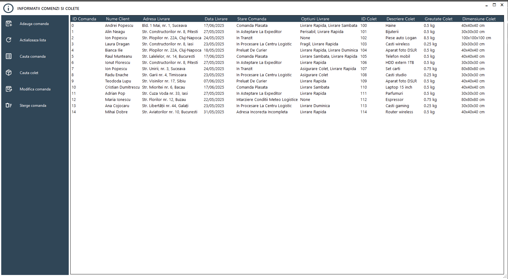
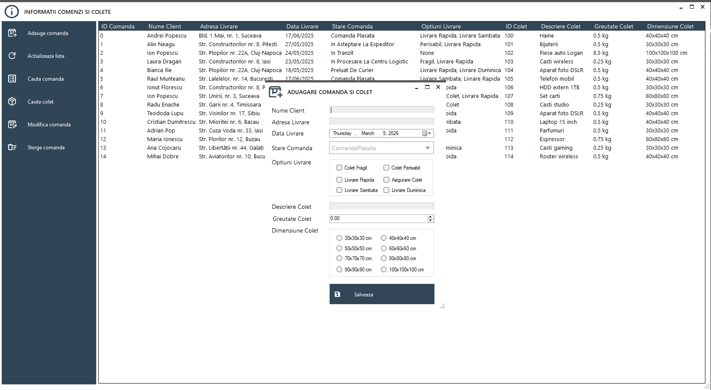
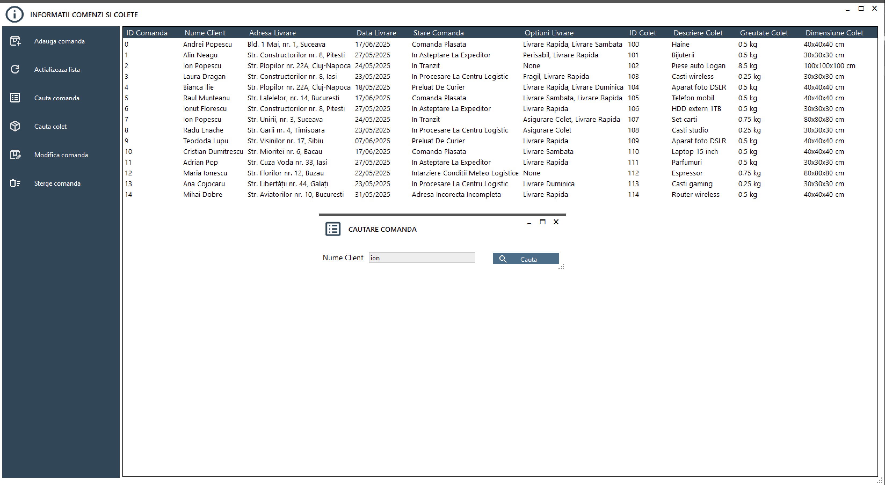
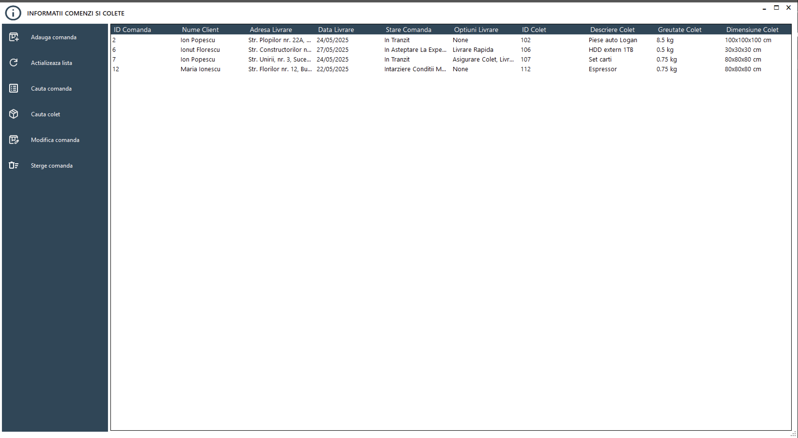
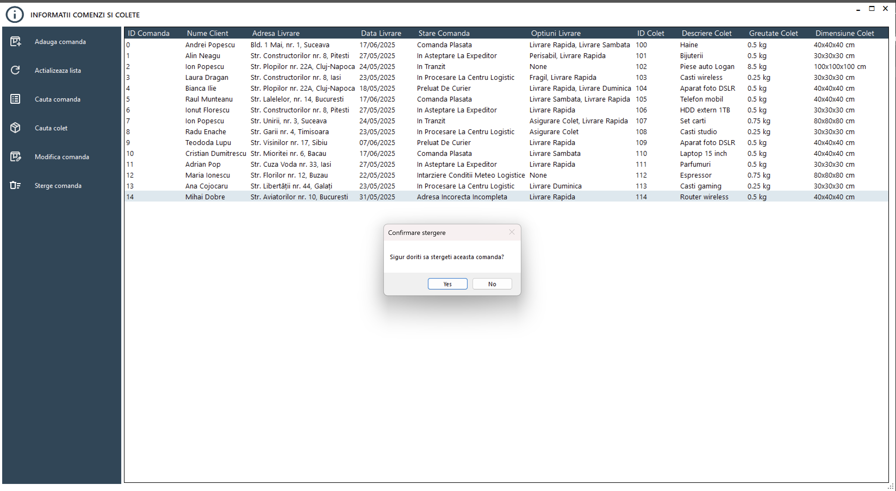

# FirmaCurierat

**FirmaCurierat** este o aplicație Windows Forms dezvoltată în C#, care vizează .NET Framework 4.8. Proiectul gestionează operațiunile unei firme de curierat, inclusiv administrarea comenzilor și coletelor, cu suport pentru stocarea datelor atât în memorie, cât și în fișiere text.

## Funcționalități

- Adăugare, modificare, căutare și afișare comenzi (`Comanda`) și colete (`Colet`)
- Stocare persistentă a datelor folosind fișiere text
- Gestionare a datelor în memorie pentru operațiuni rapide
- Interfață prietenoasă Windows Forms

## Structura Proiectului

- **LibrarieModele**: Conține modelele de date de bază (`Comanda`, `Colet`)
- **NivelStocareDate**: Gestionează stocarea și preluarea datelor (implementări în memorie și fișier text)
- **FirmaCurierat_UI_WindowsForms**: Interfața Windows Forms pentru interacțiunea cu sistemul

## Început Rapid

### Cerințe

- Visual Studio 2022 sau mai nou
- .NET Framework 4.8

### Compilare și Rulare

1. Clonează acest repository.
2. Deschide soluția în Visual Studio.
3. Restaurează pachetele NuGet dacă este necesar.
4. Compilează soluția.
5. Setează `FirmaCurierat_UI_WindowsForms` ca proiect de pornire.
6. Rulează aplicația.

## Utilizare

- **Adăugare Comandă/Colet**: Folosește formularul "Adăugare" pentru a introduce comenzi sau colete noi.
- **Căutare**: Folosește formularele "Căutare" pentru a găsi comenzi sau colete după criterii specifice.
- **Modificare**: Selectează o comandă sau un colet existent și folosește formularul "Modificare".
- **Afișare**: Vizualizează toate comenzile sau coletele în formularul "Afișare".

## Stocare Fișiere

- Comenzile și coletele sunt salvate în fișiere text pentru persistență.
- Stocarea în memorie este disponibilă pentru operațiuni temporare.

